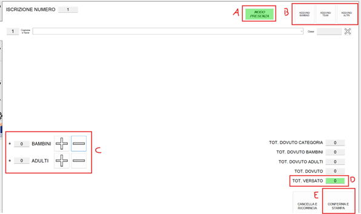

# GESTionale FESTa Estate Ragazzi

Il gestionale **GESTFEST** è stato sviluppato per facilitare la **gestione delle prenotazioni** e la **distribuzione dei buoni pasto** durante la Festa di Estate Ragazzi.

L’interfaccia è progettata per funzionare perfettamente con **tastiera** e con **touch screen**.

---

## 🔓 Avvio del Sistema

Per avviare il programma:

1. Fare doppio clic su `GestFest.exe` presente sul **desktop**.
2. Alla prima apertura comparirà la schermata di **login**, dove va inserito il PIN:

   ```
   2025
   ```

---

## 📑 Le sezioni principali (tab laterali)

### 🟩 INSERIMENTO

Questa sezione è dedicata a:

* Registrare le **presenze** alla serata (bambini, animatori, volontari).
* Segnalare **assenze certe**.

#### Procedura:

1. **Scegli il tipo di registrazione** cliccando su \[A]:

   * **Presenza**: per chi parteciperà. È possibile indicare anche accompagnatori a pagamento.
   * **Assenza**: per segnalare che una persona non sarà presente.

2. Clicca su una delle opzioni disponibili \[B]:

   * **Aggiungi Bambino**: per selezionare un bambino già iscritto all’estate ragazzi.

   * **Aggiungi Team**: per aggiungere un animatore o volontario già registrato.

   * **Aggiungi Altro**: per aggiungere una persona non presente nel sistema, solitamente un volontario esterno.

   > Puoi aggiungere più persone appartenenti alla stessa categoria.

   > ⚠ Se hai selezionato la modalità **Assenza**, puoi saltare direttamente al punto 5.

3. Inserisci eventuali **accompagnatori paganti** \[C], suddivisi tra:

   * Adulti: **€10**
   * Bambini: **€5**

4. Se ricevi subito il pagamento, clicca su `TOT. VERSATO` e inserisci l’importo ricevuto.

5. Al termine della registrazione, clicca su `CONFERMA e STAMPA`.

6. Il programma chiederà conferma dell’avvenuta stampa:

   * Se la stampa è uscita correttamente, clicca su **Sì**.
   * Se non è uscita, clicca su **No** per far ripetere la stampa.

---

### 🟥 CANCELLAZIONE

In caso di **errore nella prenotazione** o cambio di idea, questa sezione permette di annullare la prenotazione fatta, così da poterne inserire una nuova correttamente.

---

### 🟦 RIEPILOGO

Sezione per la consultazione delle prenotazioni.

#### Funzionalità disponibili:
[Schermata Funzionalità](./img/GESTFEST-2.png)

* **Bambini in attesa**: mostra i bambini che **non hanno ancora prenotato** e **non hanno comunicato l’assenza**.
* **Elenco animatori in attesa**: come sopra, ma per gli **animatori**.
* **Aggiornamento prospetto**: genera un **riepilogo aggiornato** dei partecipanti alla serata.

---

### 🟨 GESTIONE FESTA FINALE

In questa schermata è possibile **distribuire i buoni** ai partecipanti.

---

### ⚙️ AMMINISTRAZIONE

[Schermata Amministrazione](./img/GESTFEST-4.png)
Questa sezione è dedicata a funzionalità speciali, da usare solo in caso di necessità:

* **\[BYPASS INSERIMENTO Bambino]**: per aggiungere un bambino non ancora registrato.
* **\[BYPASS INSERIMENTO Animatore]**: per aggiungere un animatore non ancora presente nel sistema.
